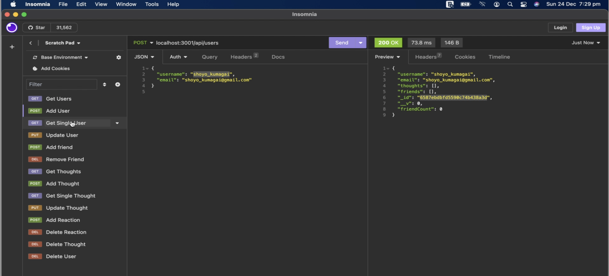
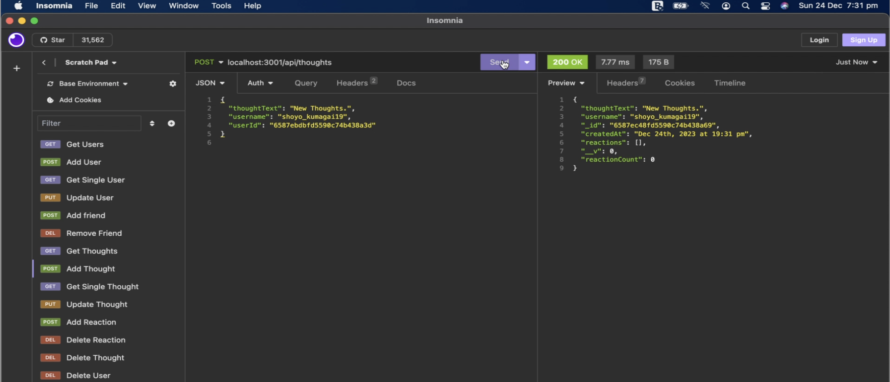
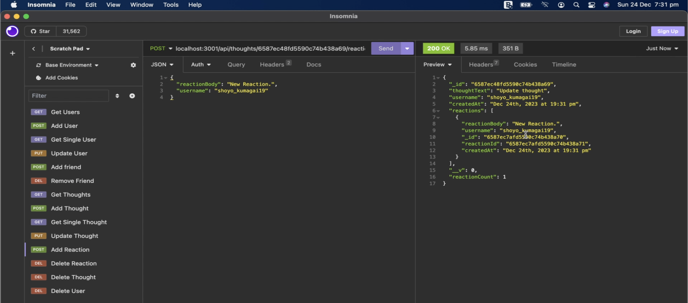

# Social Network API

## Description

A Social Network is an online platform or service which allows people to connect, interact, and share information with other people.
That is why I created this API for a social network application where users are able to add their friends, share thoughts and react to other people's thoughts, that provides a virtual space for people to connect.

## Screenshots of the application

**Add a user**

**Post a Thought**

**React to Thought**

## Credits

The underlying technologies used in this social network API are Express JS, and Mongoose, please find the documentations below:
- [Express JS](https://expressjs.com/)
- [Mongoose](https://www.npmjs.com/package/mongoose)

## Link to Video Walkthrough

